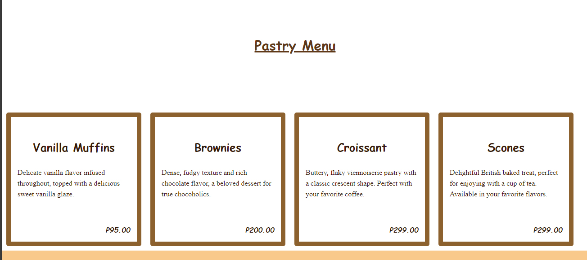

# PROJECT DESCRIPTION

Cozy Cup Cafe is a web project designed to showcase the offerings and ambiance of a fictional coffee shop named "LAVA JAVA Café." The website features an elegant and responsive design, providing users with information about the coffee and pastry menu, the cafe's story, and contact details.

## Features:

* Responsive and visually appealing web design.
* Navigation bar for easy access to different sections of the website.
* Coffee and pastry menus with detailed descriptions and prices.
* Information about the cafe, including its founding story and commitment to sustainability.
* Contact details and social media links for users to connect with the cafe.
* A footer displaying the copyright information.

## Screen Captures

* In this image, the homepage is shown for the title and the subtitle for the page, along with the logo in the center. At the top right, there is a quick access menu.

* In this image, you can see the products that are listed  in the menu, these products are the hot and cold drinks where the users can choose from.

* In this section, you can see the procucts for the pastry section that the user can choose from

* In this section, you will see the about us and the information about the application
